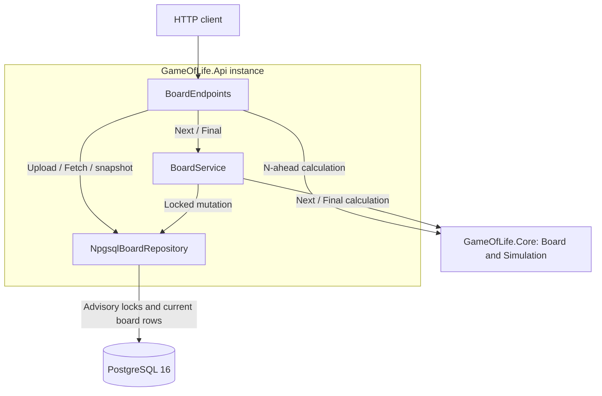
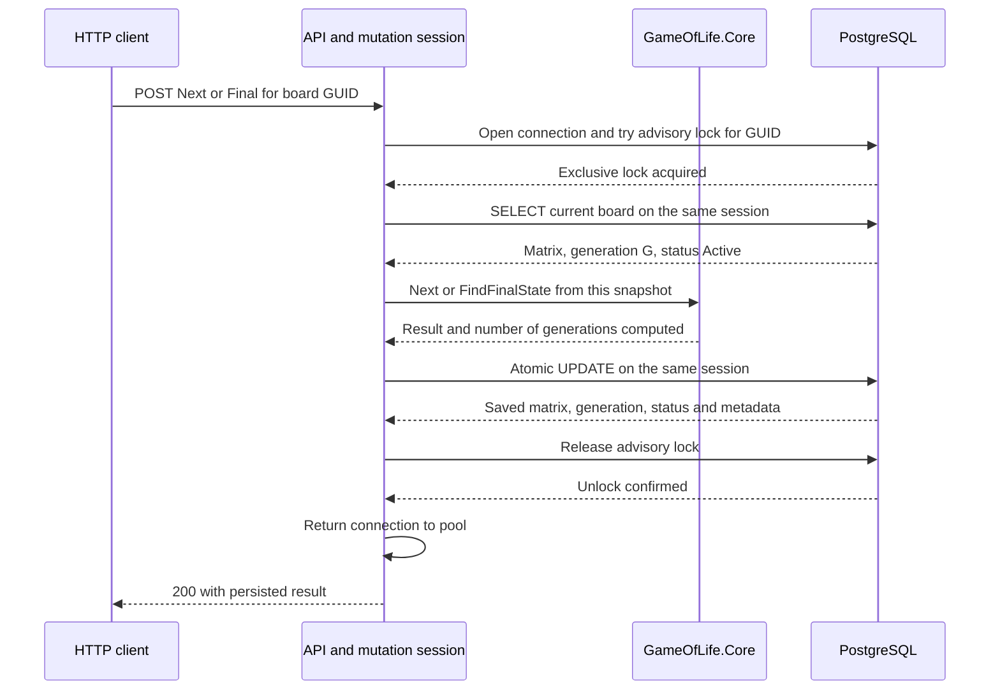
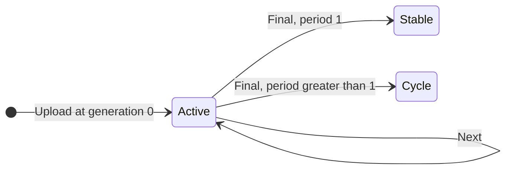

# game-of-life

A C# .NET 8 REST API for Conway's Game of Life, with PostgreSQL 16 persistence. Upload a board, advance its current state, project N generations without saving, or finish a simulation by detecting a still life or cycle. Boards and their current generation/status survive application and database restarts. No authentication is required.

## Run locally

Prerequisites: Docker with Compose v2 and curl. The .NET 8 SDK is needed to run the tests or API on the host; `global.json` selects it.

```sh
git clone https://github.com/batbrainy/game-of-life.git
cd game-of-life
[ -f .env ] || cp .env.example .env
docker compose up --build -d --wait
```

The example environment contains local development values only. `.env` and `compose.override.yaml` are ignored by Git. The stack starts PostgreSQL, runs the migration command, then starts the API. Defaults publish the API at http://localhost:8080 and PostgreSQL at localhost:5433, both on loopback only. Swagger is available at `/swagger` in Development; other environments return 404 for Swagger.

After changing code, rebuild and recreate the services explicitly:

```sh
docker compose build
docker compose up -d --force-recreate --wait
```

Stop with `docker compose down`. The `pgdata` volume retains boards. `docker compose down -v` deletes that volume and all stored boards.

## API and state semantics

| Operation | Method and path | Behavior |
|---|---|---|
| Upload | `POST /api/v1/boards` | Create a new GUID, persist generation 0 as Active, return 201 with id and Location. |
| Fetch | `GET /api/v1/boards/{id}` | Return the current persisted matrix, generation and status. |
| Next | `POST /api/v1/boards/{id}/next` | Serialize mutations for this board, calculate one generation, persist it, then return it. |
| N ahead | `GET /api/v1/boards/{id}/generations/{n}` | Project N steps from a committed current snapshot without saving or acquiring the mutation lock. |
| Final | `POST /api/v1/boards/{id}/final` | Serialize mutations, detect a repeated matrix, then persist the terminal result. |
| Liveness | `GET /health/live` | Report whether the process is serving requests. |
| Readiness | `GET /health/ready` | Check database connectivity and required migration versions. |

Next and Final use POST because they change persisted state; GET on either route returns 405.

Upload and Next leave status `Active`; Final classifies a board as `Stable` or `Cycle`. Terminal Next returns 409 with `boardStatus` and `finalStateUrl`. Repeating Final returns the saved result without changing timestamps. Projections remain available for terminal boards.

The board keeps its uploaded dimensions. Positions outside the grid count as dead; edges do not wrap.

### Example

Upload a vertical blinker:

```sh
id=$(curl -fsS http://localhost:8080/api/v1/boards \
  -H 'Content-Type: application/json' \
  -d '{"cells":[[0,1,0],[0,1,0],[0,1,0]]}' | cut -d '"' -f 4)
curl -fsS "http://localhost:8080/api/v1/boards/$id"
```

The stored board starts at generation 0. Advance it once:

```sh
curl -fsS -X POST "http://localhost:8080/api/v1/boards/$id/next"
```

```json
{"id":"<id>","generation":1,"rows":3,"columns":3,"cells":[[0,0,0],[1,1,1],[0,0,0]],"status":"Active"}
```

Project one step from this new current state:

```sh
curl -fsS "http://localhost:8080/api/v1/boards/$id/generations/1"
```

```json
{"id":"<id>","generation":2,"rows":3,"columns":3,"cells":[[0,1,0],[0,1,0],[0,1,0]],"sourceGeneration":1}
```

Fetching the board still returns the horizontal generation 1. Finish it:

```sh
curl -fsS -X POST "http://localhost:8080/api/v1/boards/$id/final"
```

```json
{"id":"<id>","generation":3,"rows":3,"columns":3,"cells":[[0,0,0],[1,1,1],[0,0,0]],"status":"Cycle","cycleStartGeneration":1,"period":2}
```

Generation 3 is when repetition was detected. `cycleStartGeneration` is where that repeated matrix was first observed in this Final run, and `period` is the difference. It is not a claim about history before the run began. A stable matrix has period 1. For example, an uploaded 2-by-2 block completes at generation 1 with cycle start 0.

A projection reports `sourceGeneration` because a concurrent mutation can finish after its snapshot was read. Its result is always N steps from that snapshot, even if storage has since advanced.

### Manual checks in Swagger and PostgreSQL

Open http://127.0.0.1:8080/swagger/index.html. Expand an operation, select **Try it out**, fill its request body or parameters, and select **Execute**. Upload returns an `id`; copy it into subsequent requests for that board. Each upload creates a separate board.

In pgAdmin, register a server with host `127.0.0.1`, port `5433`, maintenance database `gameoflife`, and username `gameoflife` when using the example environment. Use `POSTGRES_PASSWORD` from your local `.env`; custom environment values also override these connection details. Select the `gameoflife` database and open **Query Tool**.

Replace the sample UUID below with your upload's `id`. Run the query again after each API request to refresh the results:

```sql
SELECT id, generation, status, row_count, column_count, cells,
       cycle_start_generation, cycle_length,
       created_at, updated_at, completed_at
FROM public.boards
WHERE id = '00000000-0000-0000-0000-000000000000'::uuid;
```

Run the following blinker steps in order, using the same uploaded ID:

| Step | Swagger request | Expected API response and stored row |
|---|---|---|
| Upload | `POST /api/v1/boards` with `{"cells":[[0,1,0],[0,1,0],[0,1,0]]}` | 201. DB: generation 0, Active, vertical cells; terminal metadata is null. |
| Advance | `POST /api/v1/boards/{id}/next` | 200. DB: generation 1, Active, `[[0,0,0],[1,1,1],[0,0,0]]`. |
| Project | `GET /api/v1/boards/{id}/generations/1` | 200: generation 2, sourceGeneration 1, vertical cells. DB remains generation 1 with horizontal cells; timestamps also stay unchanged. |
| Finish | `POST /api/v1/boards/{id}/final` | 200. DB: generation 3, Cycle, horizontal cells, cycle_start_generation 1, cycle_length 2, completed_at populated. |
| Repeat Final | Repeat the previous request | 200 with the same result; the entire stored row, including timestamps, stays unchanged. |
| Advance a finished board | `POST /api/v1/boards/{id}/next` | 409 with boardStatus Cycle; the stored row stays unchanged. |

Additional cases use separate boards:

| Case | Request sequence | Expected result |
|---|---|---|
| Still life | Upload `{"cells":[[1,1],[1,1]]}`, then Final | 200: generation 1, Stable, unchanged cells; DB cycle_start_generation 0 and cycle_length 1. |
| Single cell dies | Upload `{"cells":[[1]]}`, then Next, then Final | Next: generation 1, Active, `[[0]]`. Final: generation 2, Stable, cycle_start_generation 1 and cycle_length 1. |
| Invalid shape | Upload `{"cells":[[1,0],[1]]}` | 400; no row inserted. |
| Invalid cell | Upload `{"cells":[[2]]}` | 400; no row inserted. |
| Invalid projection | Request generations/-1 for an existing ID | 400; no stored state or timestamp changes. |
| Unknown board | Fetch a UUID that is absent from the database | 404; no row inserted. |

For rejected uploads, compare `SELECT count(*) FROM public.boards;` before and after the request while no other uploads are running. API `period` maps to DB `cycle_length`, and `cycleStartGeneration` maps to `cycle_start_generation`. PostgreSQL holds the current state only; advancing a board updates its existing row.

## Design

### Components and dependencies

Each API instance runs the same components. `GameOfLife.Core` is an in-process library with no HTTP or database dependencies. The arrows below show calls; PostgreSQL is shared across instances.



`IBoardRepository` provides storage access, and `IBoardMutationSession` owns a mutation's lock and connection. The simulation admission limit applies to Next, N-ahead, and Final per API instance. The PostgreSQL lock separately serializes mutations of the same GUID across all instances.

### Mutation lifecycle

This is the successful path for an Active board. `NpgsqlBoardRepository` keeps one database session open from lock acquisition through release; the calculation runs without an open database transaction.



Competing mutations of the same GUID wait within the acquisition deadline and then read the latest state. Different GUIDs can proceed concurrently. A lost session aborts the mutation; it cannot reconnect to save work calculated under the old lock.

### Board lifecycle



Projections, failed searches, and rejected mutations leave storage unchanged. Final saves the repeated matrix at its detection generation, with cycle start and period.

## Persistence and concurrency

PostgreSQL stores one current row per GUID: dimensions, JSONB matrix, generation (bigint), status, timestamps, and optional cycle start and period. No history or hashes are persisted. `BoardMatrixValidator` validates matrices at upload and load boundaries; the repository owns JSON serialization. Database constraints check outer JSON shape, dimensions, generation, and terminal metadata. Inner rows and cell values are checked when loading.

Next and Final share a session advisory lock. The mutation session owns the same connection through acquisition, read, atomic save, and explicit unlock before pool reuse, including failure and cancellation paths. Calculation holds no database transaction. Upload, Fetch, and projection do not take this lock.

The deterministic key uses SHA-256 over a fixed namespace and canonical GUID, with a defined byte order and a negative sign to separate board keys from the migration lock. Rare collisions only serialize unrelated boards. PostgreSQL releases locks when a session ends. If explicit unlock fails, the pool is cleared so uncertain sessions are discarded when returned. See [PostgreSQL advisory locks](https://www.postgresql.org/docs/16/explicit-locking.html#ADVISORY-LOCKS).

Multiplexing is rejected because locks require session affinity. With pooling enabled, startup requires at least two more pool slots than the configured simulation concurrency, leaving headroom for other requests. This headroom is not a separate reserved pool. Direct SQL writers must follow the same advisory-lock protocol; advisory locks do not constrain unrelated SQL automatically.

The core owns a nested `int[][]` matrix of 0 and 1, the same representation used by HTTP and PostgreSQL JSONB. Import and export make deep copies so callers cannot mutate a board; calculation creates a new owned matrix. There is no boolean conversion or flat-array reshaping.

Final keeps only SHA-256 fingerprints mapped to first-seen steps, rather than retaining every board. Each fingerprint hashes two big-endian 32-bit dimensions followed by one byte per cell in row-major order. Matching fingerprints have negligible collision risk, but are not mathematically exact board equality. The previous 32-bit dictionary hash was correct because it also checked full equality; this change simplifies storage and reduces retained history. Starting, current and next matrices are sufficient for calculation; the repeated current matrix supplies the cycle result. Limit exhaustion returns 422 without saving intermediate progress. PostgreSQL still stores the full current matrix and metadata; no schema migration is needed for this cleanup.

### Upgrade an existing database

Migration `0002_current_board_state.sql` converts the original flattened boolean arrays to nested integer JSON, preserving row/column order, GUIDs, and creation timestamps. Existing boards become Active at generation 0. Migration 0001 remains unchanged.

This is a breaking schema and HTTP contract change, not a rolling upgrade. Stop every old API instance before applying the migration; old binaries cannot read the new JSONB column. For the local stack:

```sh
docker compose stop api
docker compose build
docker compose up -d --force-recreate --wait
```

The dedicated `migrate` command applies numbered embedded SQL scripts in a transaction, coordinated by a migration advisory lock. The API runs no schema changes. Migration history is versioned but not checksummed; never edit an already-applied migration. Add a new numbered script instead. Readiness checks migration versions, not compatibility with older binaries.

## Validation, errors, and limits

Uploads require a nonempty rectangular matrix with integer 0 or 1 cells. Null rows, invalid values, malformed JSON, invalid GUIDs, and invalid N return 400. The request-body limit is 1 MiB (1,048,576 bytes); oversized bodies return 413. Unsupported upload content types return 415.

| Status | Meaning |
|---|---|
| 404 | Unknown board GUID. |
| 405 | Unsupported method, including GET on Next/Final. |
| 409 | Next on a terminal board, or generation-counter overflow. |
| 422 | Final did not conclude within its limit, or an existing board exceeds the current simulation size settings. |
| 503 | Database unavailable, process simulation bound reached, or board-lock acquisition timed out. |
| 500 | An unexpected application/database failure. Internal details are not returned. |

Terminal conflicts include `boardStatus` and `finalStateUrl`. Iteration-limit errors include `maxGenerations`. Admission rejection and board-lock timeout include `Retry-After: 1`. Lock acquisition uses one deadline covering pool/connection acquisition and lock waiting. Request cancellation interrupts waiting or simulation between generations, and releases owned resources.

Application errors use Problem Details, subject to content negotiation. Kestrel may reject malformed or oversized requests before the application pipeline with an empty error response.

Defaults live in the `GameOfLife` section of [appsettings.json](src/GameOfLife.Api/appsettings.json). Environment variables or environment-specific settings can override them; startup validates positive values, combined budgets, and runtime constraints.

| Setting | Default | Validation |
|---|---|---|
| MaxRows | 256 | Positive; configured dimensions must fit MaxBoardCells and the supported cell count |
| MaxColumns | 256 | Positive; same combined dimension checks |
| MaxGenerationsAhead | 500 | Positive; requests accept N from 0 through this limit |
| MaxFinalStateGenerations | 500 | Positive; combined work and retained-state budgets apply |
| MaxConcurrentSimulations | 8 | Positive; retained-state budget, pool headroom and runtime worker capacity apply |
| BoardLockTimeoutSeconds | 5 | Positive; must fit the runtime timer duration |
| MaxBoardCells | 65536 | Positive; bounds MaxRows times MaxColumns |
| MaxSimulationCellSteps | 67108864 | Positive; bounds board size times the larger iteration limit |
| MaxRetainedStateBytes | 536870912 (512 MiB) | Positive; bounds estimated working matrices and fingerprint history across concurrent Final runs |

For each Final run, the retained-state estimate is `3 * (4 * MaxRows * MaxColumns + 32 * MaxRows + 24) + MaxColumns + 256 * (MaxFinalStateGenerations + 1)` bytes, multiplied by `MaxConcurrentSimulations`. It allows three working int matrices (starting/current/next), estimated 64-bit row-array overhead, a one-row fingerprint buffer, and 256 bytes per history entry for a 64-character hex SHA-256 string plus dictionary storage and resizing. At defaults this is about 7.2 MiB across eight simulations, instead of the previous 250.5 MiB estimate for historical bool cell buffers alone. Matrix memory grows with board size; history memory grows with the iteration limit, independently of board size.

This is an estimate, not a guarantee of total process memory or latency. It excludes JSON serialization/copies, HTTP processing, connection pools, hashing runtime overhead, and garbage waiting for collection. Integer matrices use four bytes per cell and allocate a new matrix each generation, so lower retained history does not mean lower total allocation. A legacy board or one uploaded under larger settings remains fetchable but returns 422 for simulation if it exceeds the current dimensions.

For Compose overrides, add environment variables such as `GameOfLife__BoardLockTimeoutSeconds=10` under `services.api.environment` in an ignored `compose.override.yaml`, then recreate the API. Increase workload and resource budgets after measuring CPU and memory. Connection strings must parse, disable Multiplexing, and satisfy pool headroom validation.

## Build and test

```sh
dotnet build GameOfLife.sln
dotnet test GameOfLife.sln
dotnet format --verify-no-changes
```

The SDK and runtime must both be .NET 8. If installed in a custom directory, set DOTNET_ROOT and invoke that installation so xUnit's child process can find the runtime. Tests use xunit.v3 and real PostgreSQL through Testcontainers; Docker must be running.

Tests cover rules, immutable snapshots, cycle detection against an independent full-matrix search, canonical fingerprint encoding, JSON persistence, legacy migration, terminal behavior, projection semantics, validation, database errors, independent API hosts mutating the same board, lock timeout/cancellation, session termination, pooled-connection reuse, atomic failed writes, and persistence across new API hosts.

With the stack running:

```sh
scripts/smoke-test.sh
scripts/measure-worst-case.sh http://localhost:8080 8
```

`smoke-test.sh` verifies mutation, projection, completion, and HTTP errors. `measure-worst-case.sh` times full-limit searches sequentially, concurrently on different GUIDs, and under same-GUID contention; the latter may reach the lock timeout. Its required concurrency argument must match the running API configuration. It rejects early/cached final results for its deterministic test pattern.

`verify-restart.sh` restarts, kills, and recreates containers and checks persisted Active and Cycle boards. Run it on a dedicated stack with separate ports, image tag, and volume. For example, from a clean checkout without a local Compose override:

```sh
cat > /tmp/gameoflife-verification.yaml <<'YAML'
services:
  api:
    image: game-of-life-verification
  migrate:
    image: game-of-life-verification
YAML
export COMPOSE_PROJECT_NAME=gameoflife-verification
export COMPOSE_FILE="$PWD/compose.yaml:/tmp/gameoflife-verification.yaml"
export API_PORT=18080 DB_PORT=15433
docker compose up --build -d --wait
scripts/smoke-test.sh http://localhost:18080
scripts/verify-restart.sh http://localhost:18080
docker compose down -v  # deletes only this verification project's data
unset COMPOSE_PROJECT_NAME COMPOSE_FILE API_PORT DB_PORT
rm /tmp/gameoflife-verification.yaml
```

### Measured costs

Reference measurements after the matrix/fingerprint cleanup used the Release Docker image on an Apple M1 Max with 64 GiB RAM; Docker had 10 CPUs and 7.7 GiB. Defaults were 256 by 256 cells, 500 steps, eight admitted simulations, and a five-second lock-acquisition timeout. The deterministic pattern in `measure-worst-case.sh` exhausts Final's limit, so these measurements include a complete search rather than replaying a saved terminal result.

| Workload | Observed duration |
|---|---|
| Five sequential N-ahead projections, N = 500 | 0.658–0.739 s; mean 0.696 s |
| Five sequential full-limit Final searches | 0.631–0.746 s; mean 0.678 s |
| Eight Final searches on different GUIDs concurrently | 0.839–0.971 s; mean 0.898 s |
| Eight Final requests on the same GUID concurrently | Eight serialized searches returned 422 in 0.649–5.220 s; no lock timeouts in this run |

The same-GUID requests left generation 0 and Active status unchanged. Lock timeouts remain possible under heavier contention. Lock timeout bounds acquisition, not the search after acquisition, so a completed request can take longer than five seconds. Timings are observations from one run, not latency guarantees; resource budgets also account for working matrices, fingerprint history, and concurrent requests.

## Operational limits

- Computation runs in the request, not as a durable background job. Cancellation before saving or iteration exhaustion saves no progress. A committed update survives a lost response; the client may not know whether it committed.
- Next and Upload are not idempotent. Retrying Next can advance twice; retrying Upload creates another GUID. Fetch current state after an ambiguous response. The API does not automatically replay uncertain mutations.
- Synchronous simulation occupies thread-pool workers. Startup raises the minimum to at least processor count plus MaxConcurrentSimulations. This leaves workers for health checks and overload responses, but CPU contention still affects latency.
- There is no per-client rate limiting, general request deadline, board deletion/retention policy, authentication, or TLS termination. The sample exposes loopback HTTP for local use.
- A database that accepts connections but stops answering can retain admission permits until command/connection timeouts or request cancellation. Board-lock waiting has its separate deadline; an in-flight save still follows database command timeout behavior.
- After a database restart, stale pooled connections may produce transient 503 responses while broken connections are discarded. Restart checks retry fetches; they do not replay mutation requests.
- The local sample uses one PostgreSQL role for migration and application access. Production deployment should separate schema privileges.

## License

[MIT](LICENSE)
