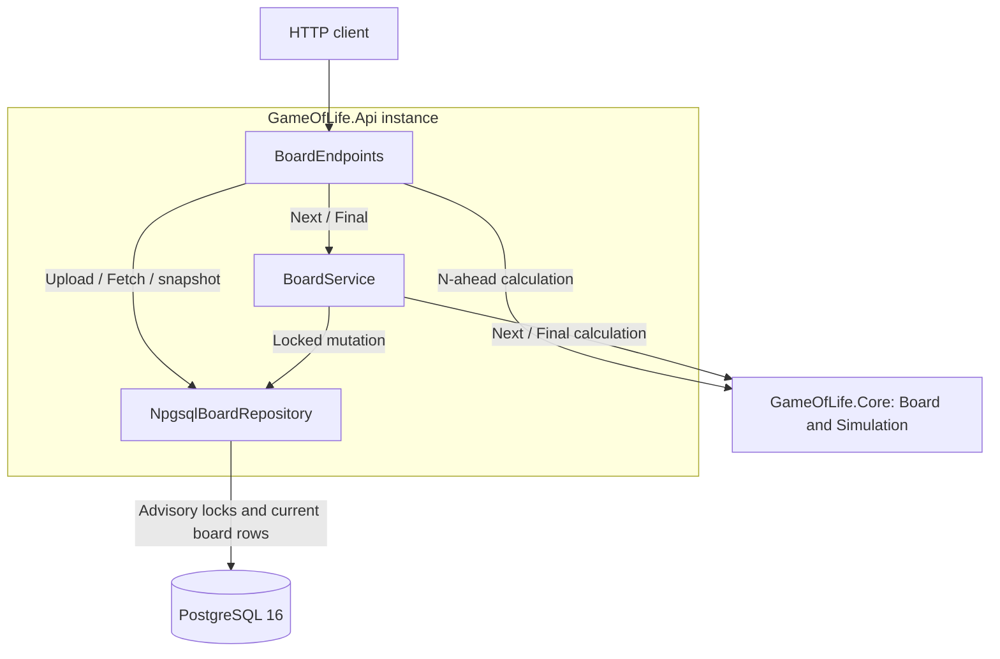
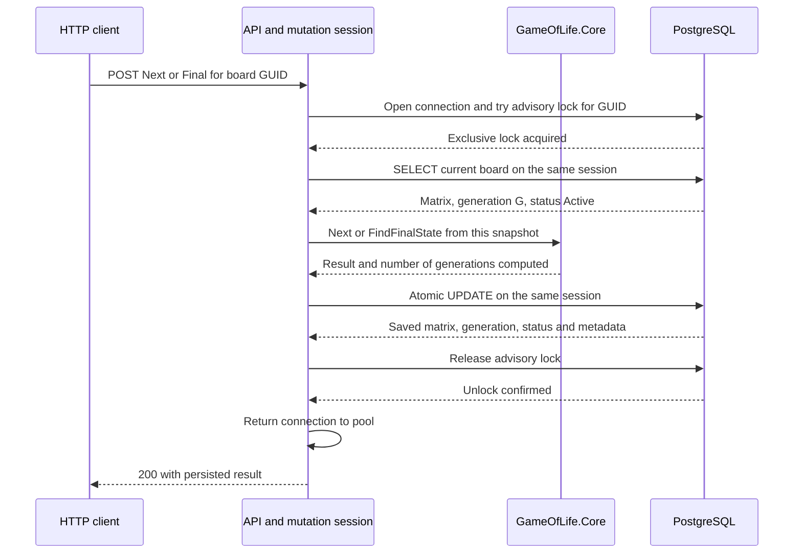
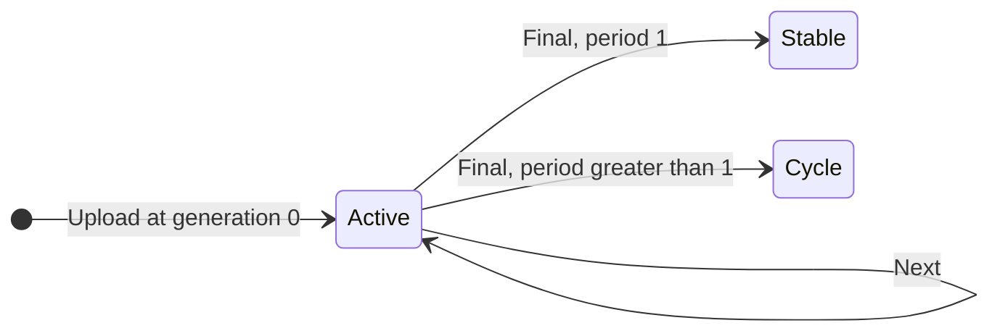

# game-of-life

A C# .NET 8 REST API for Conway's Game of Life, with PostgreSQL 16 persistence. Upload a board, advance its current state, project N generations without saving, or finish a simulation by detecting a still life or cycle. Boards and their current generation/status survive application and database restarts. No authentication is required.

## Run locally

Prerequisites: Docker with Compose v2 and curl. The .NET 8 SDK is needed to run the tests or API on the host; `global.json` selects it.

```sh
[ -f .env ] || cp .env.example .env
docker compose up --build -d --wait
```

The example environment contains local development values only. `.env` and `compose.override.yaml` are ignored by Git. The stack starts PostgreSQL, runs the migration command, then starts the API. Defaults publish the API at http://localhost:8080 and PostgreSQL at localhost:5433, both on loopback only. Swagger is available at `/swagger` in Development; other environments return 404 for Swagger.

After changing code, rebuild and recreate the services explicitly:

```sh
docker compose build
docker compose up -d --force-recreate --wait
```

Stop with `docker compose down`. The `pgdata` volume retains boards. `docker compose down -v` deletes that volume and all stored boards.

## API and state semantics

| Operation | Method and path | Behavior |
|---|---|---|
| Upload | `POST /api/v1/boards` | Create a new GUID, persist generation 0 as Active, return 201 with id and Location. |
| Fetch | `GET /api/v1/boards/{id}` | Return the current persisted matrix, generation and status. |
| Next | `POST /api/v1/boards/{id}/next` | Serialize mutations for this board, calculate one generation, persist it, then return it. |
| N ahead | `GET /api/v1/boards/{id}/generations/{n}` | Project N steps from a committed current snapshot without saving or acquiring the mutation lock. |
| Final | `POST /api/v1/boards/{id}/final` | Serialize mutations, detect a repeated matrix, then persist the terminal result. |
| Liveness | `GET /health/live` | Report whether the process is serving requests. |
| Readiness | `GET /health/ready` | Check database connectivity and required migration versions. |

The exercise names operations but leaves mutation behavior open to interpretation. This API deliberately uses the hybrid semantics above. Next and Final use POST because they change persisted state. Their former GET routes return 405; clients must update their calls.

A board has status `Active`, `Stable`, or `Cycle`. Upload and ordinary Next leave it Active; Final classifies completion. Once terminal, Next returns 409 with the status and a `finalStateUrl`. Repeating Final returns the saved result without recalculating or changing timestamps. Projections remain available for terminal boards.

The board keeps its uploaded dimensions. Positions outside the grid count as dead; edges do not wrap.

### Example

Upload a vertical blinker:

```sh
id=$(curl -fsS http://localhost:8080/api/v1/boards \
  -H 'Content-Type: application/json' \
  -d '{"cells":[[0,1,0],[0,1,0],[0,1,0]]}' | cut -d '"' -f 4)
curl -fsS "http://localhost:8080/api/v1/boards/$id"
```

The stored board starts at generation 0. Advance it once:

```sh
curl -fsS -X POST "http://localhost:8080/api/v1/boards/$id/next"
```

```json
{"id":"<id>","generation":1,"rows":3,"columns":3,"cells":[[0,0,0],[1,1,1],[0,0,0]],"status":"Active"}
```

Project one step from this new current state:

```sh
curl -fsS "http://localhost:8080/api/v1/boards/$id/generations/1"
```

```json
{"id":"<id>","generation":2,"rows":3,"columns":3,"cells":[[0,1,0],[0,1,0],[0,1,0]],"sourceGeneration":1}
```

Fetching the board still returns the horizontal generation 1. Finish it:

```sh
curl -fsS -X POST "http://localhost:8080/api/v1/boards/$id/final"
```

```json
{"id":"<id>","generation":3,"rows":3,"columns":3,"cells":[[0,0,0],[1,1,1],[0,0,0]],"status":"Cycle","cycleStartGeneration":1,"period":2}
```

Generation 3 is when repetition was detected. `cycleStartGeneration` is where that repeated matrix was first observed in this Final run, and `period` is the difference. It is not a claim about history before the run began. A stable matrix has period 1. For example, an uploaded 2-by-2 block completes at generation 1 with cycle start 0.

A projection reports `sourceGeneration` because a concurrent mutation can finish after its snapshot was read. Its result is always N steps from that snapshot, even if storage has since advanced.

## Design

### Components and dependencies

Each API instance runs the same components. `GameOfLife.Core` is an in-process library with no HTTP or database dependencies. The arrows below show calls; PostgreSQL is shared across instances.



`IBoardRepository` provides storage access, and `IBoardMutationSession` owns a mutation's lock and connection. The simulation admission limit applies to Next, N-ahead, and Final per API instance. The PostgreSQL lock separately serializes mutations of the same GUID across all instances.

### Mutation lifecycle

This is the successful path for an Active board. `NpgsqlBoardRepository` keeps one database session open from lock acquisition through release; the calculation runs without an open database transaction.



A competing Next or Final for the same GUID retries acquisition within its deadline, then reads the latest committed state only after obtaining the lock. A different GUID can proceed concurrently. Upload uses a new GUID; Fetch and N-ahead read a committed snapshot without taking the mutation lock. N-ahead calculates in memory and returns directly without an UPDATE.

If acquisition times out, the API returns 503. If Final exhausts its iteration limit, it releases the lock and returns 422 without saving intermediate progress. Terminal checks also happen under the lock: Next returns 409, while Final returns the saved terminal result. A lost session aborts the mutation; it cannot reconnect to write a result computed under the old lock.

### Board lifecycle



Next increments the generation and leaves status Active. Stable and Cycle are terminal for advancement. Their rows remain available to Fetch and N-ahead, and repeated Final calls return the saved result. Projections, failed searches, and rejected mutations leave the stored state unchanged. Final saves the matrix at the repetition-detection generation, along with the cycle start and period; each board retains one current row.

## Persistence and concurrency

`GameOfLife.Core` contains the immutable Board, Conway rules, and in-memory simulation. It has no HTTP or database dependencies. Each step reads the previous buffer and allocates a separate next buffer. Internally the engine uses bool arrays; the API and persisted JSON matrix use integer 0/1 rows.

PostgreSQL stores one current row per GUID: dimensions, JSONB matrix, generation (bigint), status, creation/update/completion timestamps, and optional cycle-start generation and length. `BoardMatrixMapper` converts between the immutable Board and `int[][]`; the repository owns JSON serialization/deserialization. Complete matrix validation happens at application boundaries, including loading stored data; database constraints also check basic JSON shape, dimensions, generation, and terminal metadata. Historical matrices and hashes are not persisted.

`BoardService` coordinates mutations through `IBoardMutationSession`. `NpgsqlBoardRepository` owns the session-level PostgreSQL advisory lock and its connection:

1. Open one connection and acquire the board's exclusive advisory lock within the configured timeout.
2. Read the latest snapshot and check terminal status after acquiring the lock.
3. Calculate in memory while retaining the session, without a long-running transaction.
4. Save matrix, generation, status, and metadata atomically in one UPDATE on the same connection.
5. Explicitly unlock before returning the connection to its pool, including all failure/cancellation paths.

Next and Final share this lock across application instances. Other GUIDs can execute concurrently. Upload, Fetch, and N-ahead do not take it. The process-wide simulation limiter is additional admission control; it is not the distributed lock.

The key uses SHA-256 over a fixed namespace and canonical GUID, with a defined byte order and the sign bit set. Negative board keys are separate from the migration runner's positive lock key. Rare hash collisions only serialize unrelated boards. This avoids adding Redis when PostgreSQL already provides shared coordination. Session locks are released when their database session ends. If the session fails, the operation cannot reconnect and save stale work. If explicit unlock fails, the pool is cleared so uncertain sessions are discarded when returned. See [PostgreSQL advisory locks](https://www.postgresql.org/docs/16/explicit-locking.html#ADVISORY-LOCKS).

Multiplexing is rejected because locks require session affinity. With pooling enabled, startup requires at least two more pool slots than the configured simulation concurrency, leaving headroom for other requests. This headroom is not a separate reserved pool. Direct SQL writers must follow the same advisory-lock protocol; advisory locks do not constrain unrelated SQL automatically.

A Final run keeps a dictionary of immutable boards and first-seen steps. Hashes narrow lookups, then full matrix equality prevents false cycle detection from hash collisions. The detected matrix is persisted; period 1 is Stable, greater than 1 is Cycle. If the limit expires, no intermediate state is saved.

### Upgrade an existing database

Migration `0002_current_board_state.sql` converts the original flattened boolean arrays to nested integer JSON, preserving row/column order, GUIDs, and creation timestamps. Existing boards become Active at generation 0. Migration 0001 remains unchanged.

This is a breaking schema and HTTP contract change, not a rolling upgrade. Stop every old API instance before applying the migration; old binaries cannot read the new JSONB column. For the local stack:

```sh
docker compose stop api
docker compose build
docker compose up -d --force-recreate --wait
```

The dedicated `migrate` command applies numbered embedded SQL scripts in a transaction, coordinated by a migration advisory lock. The API runs no schema changes. Migration history is versioned but not checksummed; never edit an already-applied migration. Add a new numbered script instead. Readiness checks migration versions, not compatibility with older binaries.

## Validation, errors, and limits

Uploads require a nonempty rectangular matrix with integer 0 or 1 cells. Null rows, invalid values, malformed JSON, invalid GUIDs, and invalid N return 400. The request-body limit is 1 MiB (1,048,576 bytes); oversized bodies return 413. Unsupported upload content types return 415.

| Status | Meaning |
|---|---|
| 404 | Unknown board GUID. |
| 405 | Unsupported method, including GET on Next/Final. |
| 409 | Next on a terminal board, or generation-counter overflow. |
| 422 | Final did not conclude within its limit, or an existing board exceeds the current simulation size settings. |
| 503 | Database unavailable, process simulation bound reached, or board-lock acquisition timed out. |
| 500 | An unexpected application/database failure. Internal details are not returned. |

Terminal conflicts include `boardStatus` and `finalStateUrl`. Iteration-limit errors include `maxGenerations`. Admission rejection and board-lock timeout include `Retry-After: 1`. Lock acquisition uses one deadline covering pool/connection acquisition and lock waiting. Request cancellation interrupts waiting or simulation between generations, and releases owned resources.

Application errors use Problem Details. Content negotiation can produce plain-text or empty responses when the client refuses JSON. The request-body 413 may omit `type`. Kestrel can reject malformed headers or oversized headers before the application pipeline, with an empty 400 or 431 body regardless of Accept.

Defaults live in the `GameOfLife` section of [appsettings.json](src/GameOfLife.Api/appsettings.json). Environment variables or environment-specific settings can override each setting below. `GameOfLifeOptions` contains validation, with no duplicated defaults or fixed policy ceilings.

| Setting | Default | Validation |
|---|---|---|
| MaxRows | 256 | Positive; configured dimensions must fit MaxBoardCells and the engine array |
| MaxColumns | 256 | Positive; same combined dimension checks |
| MaxGenerationsAhead | 500 | Positive; requests accept N from 0 through this limit |
| MaxFinalStateGenerations | 500 | Positive; combined work and retained-state budgets apply |
| MaxConcurrentSimulations | 8 | Positive; retained-state budget, pool headroom and runtime worker capacity apply |
| BoardLockTimeoutSeconds | 5 | Positive; must fit the runtime timer duration |
| MaxBoardCells | 65536 | Positive; bounds MaxRows times MaxColumns |
| MaxSimulationCellSteps | 67108864 | Positive; bounds board size times the larger iteration limit |
| MaxRetainedStateBytes | 536870912 (512 MiB) | Positive; bounds retained cell buffers across concurrent Final runs |

All settings are validated on startup. Retained cell buffers are estimated as `MaxRows * MaxColumns * (MaxFinalStateGenerations + 1) * MaxConcurrentSimulations` bytes: the initial board plus each computed board, with one byte per bool cell. This budget excludes JSON conversion, object/dictionary overhead, HTTP processing, connection pools, and GC. It is not a guarantee of total process memory or latency. A legacy board or one uploaded under larger settings remains fetchable but returns 422 for simulation if it exceeds the current dimensions.

For example, `GameOfLife__MaxRows=2048` and `GameOfLife__MaxColumns=1` permit a tall board within the default resource budgets; there is no fixed 1024-row ceiling. `GameOfLife__BoardLockTimeoutSeconds=10` changes lock waiting. Increase resource budgets deliberately when a larger workload requires them, after measuring available CPU and memory. For Compose, add settings under `services.api.environment` in a local `compose.override.yaml`; recreate the API after changing them. Connection strings must parse, disable Multiplexing, and satisfy pool headroom validation.

## Build and test

```sh
dotnet build GameOfLife.sln
dotnet test GameOfLife.sln
dotnet format --verify-no-changes
```

The SDK and runtime must both be .NET 8. If installed in a custom directory, set DOTNET_ROOT and invoke that installation so xUnit's child process can find the runtime. Tests use xunit.v3 and real PostgreSQL through Testcontainers; Docker must be running.

Tests cover rules, immutable snapshots, exact cycle detection, JSON persistence, legacy migration, terminal behavior, projection semantics, validation, database errors, independent API hosts mutating the same board, lock timeout/cancellation, session termination, pooled-connection reuse, atomic failed writes, and persistence across new API hosts.

Run scripts against an isolated Compose project when checking crashes:

```sh
scripts/smoke-test.sh
scripts/measure-worst-case.sh http://localhost:8080 8
scripts/verify-restart.sh
```

`smoke-test.sh` verifies mutation, projection, completion, and HTTP errors. `measure-worst-case.sh` times full-limit searches sequentially, concurrently on different GUIDs, and under same-GUID contention; the latter may reach the lock timeout. Its required concurrency argument must match the running API configuration. It rejects early/cached final results for its deterministic test pattern.

`verify-restart.sh` restarts, kills, and recreates the selected Compose project's containers. It verifies both an advanced Active board and a completed Cycle board. Select a dedicated project with COMPOSE_PROJECT_NAME and separate ports, image tag, and volume before running it; do not use a stack whose other work must remain running.

### Verification and measurements

The current implementation passed 266 tests (92 core and 174 API/configuration/PostgreSQL), a warning-free .NET 8 build, formatting verification, 19 Docker smoke checks, and 13 restart/crash checks. Configuration tests cover overrides above the former fixed ceilings, budget boundaries, positive values, and arithmetic/runtime limits. Final-state tests also verify that generation overflow depends on computed steps rather than the configured search budget. The restart checks cover API restart, abrupt API termination, abrupt PostgreSQL termination, and container recreation while retaining the database volume.

Measured with the Release Docker image on an Apple M1 Max with 64 GiB RAM; Docker had 10 CPUs and 7.7 GiB. Defaults were 256 by 256 cells, 500 steps, eight admitted simulations, and a five-second lock-acquisition timeout. The deterministic pattern in `measure-worst-case.sh` exhausts Final's limit, so these measurements include a complete search rather than replaying a saved terminal result.

| Workload | Observed duration |
|---|---|
| Five sequential N-ahead projections, N = 500 | 0.791–0.886 s; mean 0.815 s |
| Five sequential full-limit Final searches | 0.796–0.814 s; mean 0.802 s |
| Eight Final searches on different GUIDs concurrently | 0.899–0.936 s; mean 0.928 s |
| Eight Final requests on the same GUID concurrently | Seven serialized searches returned 422 in 0.800–5.633 s; one lock timeout returned 503 in 5.015 s |

The same-GUID requests left generation 0 and Active status unchanged. Lock timeout bounds acquisition, not the search after acquisition, so a completed request can take longer than five seconds. Timings are observations from one run, not latency guarantees; resource budgets also account for retained boards and concurrent requests.

## Operational limits

- Computation runs in the request, not as a durable background job. Cancellation before saving or iteration exhaustion saves no progress. A committed update survives a lost response; the client may not know whether it committed.
- Next and Upload are not idempotent. Retrying Next can advance twice; retrying Upload creates another GUID. Fetch current state after an ambiguous response. The API does not automatically replay uncertain mutations.
- Synchronous simulation occupies thread-pool workers. Startup raises the minimum to at least processor count plus MaxConcurrentSimulations, preserving the thread-pool improvement already on the main branch. This leaves workers for health checks and overload responses, but CPU contention still affects latency.
- There is no per-client rate limiting, general request deadline, board deletion/retention policy, authentication, or TLS termination. The sample exposes loopback HTTP for local use.
- Each Final retains earlier matrices in memory during that run. At default dimensions and 500 steps this is approximately 33 MB of cell buffers per request, before object/JSON/runtime overhead. Increase workload limits only after measuring available CPU and memory.
- A database that accepts connections but stops answering can retain admission permits until command/connection timeouts or request cancellation. Board-lock waiting has its separate deadline; an in-flight save still follows database command timeout behavior.
- After a database restart, stale pooled connections may produce transient 503 responses while broken connections are discarded. Restart checks retry fetches; they do not replay mutation requests.
- The local sample uses one PostgreSQL role for migration and application access. Production deployment should separate schema privileges.
- .NET 8 reaches end of support on November 10, 2026. The exercise explicitly targets net8.0; deployment beyond that date requires an upgrade plan. See [Microsoft's support policy](https://dotnet.microsoft.com/en-us/platform/support/policy/dotnet-core).
- TreatWarningsAsErrors makes NuGet audit warnings build errors. With the selected .NET 8 defaults, restore audits direct dependencies; transitive auditing requires enabling NuGetAuditMode=all. Resolve advisories deliberately rather than relying on unchanged restore results.

## License

[MIT](LICENSE)
